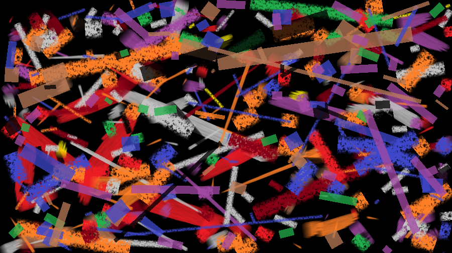

# pynter
Pynter uses Python to auto-generate "paintings" using MS Paint

Pynter is inspired by (and derived from) this [reddit post](https://www.reddit.com/r/Python/comments/ebjgvl/i_wrote_a_program_that_doodles_things_in_ms_paint/)

### Works only on MS Windows
I've only tried it on Windows 10. Also, this is calibrated for MS Paint program. (Might be difficult in Mac OS or Linux.)

**Some Observations**
- The type of Brush style that you choose makes a big difference
- In order to speed things up, I choose a fixed Canvas size and don't move the MS Paint window. This means I only have to calibrate once, and can reuse the coordinates.
- You will have to Calibrate it the first few times.

Run `python pynter.py` and make sure that **MS Paint** is visible once the wait_time is complete.